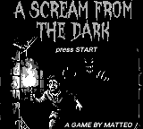
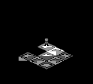

# A Scream from the Dark

<p align="center">
  
</p>

Un survival-horror procedurale in prospettiva isometrica per Game Boy (DMG/CGB), scritto in C con **GBDK-2020**. Sei imprigionato in un labirinto generato casualmente, illuminato solo da un ristretto quadrato di visibilità. Dei **fantasmi** si nascondono nel buio e ti braccano. L'unica via di fuga è una **botola** posta lontano dalla partenza: raggiungerla significa "sprofondare più giù" (*Going Deeper*) e affrontare un livello più grande, con più nemici e meno visibilità.

---

## Autore

**Matteo Benedetto** — [me@enne2.net](mailto:me@enne2.net)

Crediti visibili anche nel gioco: schermata **SELECT** dal menu titolo.

---

## Caratteristiche

- **Proiezione isometrica 2.5D**: rendering a diamante (tile 32×16 px) con autotiling dinamico e multi-pass.
- **Labirinto casuale crescente**: DFS iterativo con stack in WRAM che genera un perfect maze, rotto al 15% per creare loop. La dimensione cresce di 2 tile/lato per livello: 7×7 → 21×21.
- **Fog of War scalabile**: visibilità basata su Chebyshev. 5×5 (livelli 1-6), 3×3 (livelli 7-8). Il nemico si attiva solo quando entra nella nebbia.
- **Movimento interpolato (LERP)**: punto fisso `>>4`, no float. 16 frame/passo (8 in corsa).
- **DAS**: controlli alla Tetris — delay 12 frame, repeat 6 (walk) / 2 (run).
- **Salto evasivo**: A+direzione, 2 tile, costa 60 stamina. Arco parabolico visivo.
- **Corsa**: B+direzione, 8 frame/tile, 10 stamina/tile. Fallback a camminata se stamina < 10.
- **Progressione 8 livelli**: difficoltà crescente (maze, nemici, cooldown, stamina, nebbia). Indicatore `L<n>` in alto a sinistra. Sconfitta → ricomincia dallo stesso livello.
- **Multi-nemico**: fino a 8 fantasmi (1 per livello). AI greedy, cooldown scalabile (60→11 frame), hitbox pixel-perfect.
- **Audio procedurale**: 4 canali APU via VBL interrupt. Title (112 note, 3 canali), gameplay (96), gameover (128), schermata conclusiva (192, loop).
- **Schermate**: title con sfondo 2-bit, death con `claimed.png`, Going Deeper testuale, schermata conclusiva con font IBM.
- **Test headless**: PyBoy + OpenCV + ROM di test isolate.

### Soundtrack

1. **Title Theme**: 112 note su 3 canali (melodia + basso indipendente + rintocchi noise), ~56 sec in loop. Lamento discendente in Re minore con 7ª armonica (C#) e discesa cromatica.
2. **Gameplay Theme**: battito ritmico ansioso ("eerie pulse") in La minore → Re minore → Mi7.
3. **Game Over Theme**: concerto polifonico di 128 note con percussioni (thud + crash).
4. **Schermata conclusiva**: brano dedicato di 192 note (24 accordi), lamento discendente Dm → loop infinito. CH1 melodia sommessa + CH2 basso + CH4 toll (mid/crash/deep).
5. **Going Deeper**: melodia misteriosa discendente di 96 step (Am → Fmaj7 → Dm → E7 → C aug).

---

## Dettagli tecnici

### Architettura dei file
- [`main.c`](src/main.c): entry point, loop VBL, `app_state` (0=title, 1=game).
- [`engine.c`](src/engine.c): orchestrazione, game-over branches (sconfitta/vittoria).
- [`globals.c`](src/globals.c) / [`globals.h`](src/globals.h): stato globale (mappa `[21][21]`, `map_size`, `fog_radius`, `level`, `num_enemies`, enemy arrays[8], stamina, ecc.).
- [`maze.c`](src/maze.c): DFS + loop + botola. Array statici in WRAM.
- [`player_logic.c`](src/player_logic.c): DAS, camminata, corsa, salto, stamina.
- [`enemy_logic.c`](src/enemy_logic.c): AI greedy multi-entity, cooldown scalabile, hitbox.
- [`render.c`](src/render.c): iso, fog scalabile, auto-tiling, flush dinamico, HUD.
- [`sound.c`](src/sound.c): sequencer VBL, 5 tracce + SFX.
- Asset: `tiles.c`, `player.c`, `enemy.c`, `gameover.c`, `stamina.c`, `level.c`, `claimed.c`, `title_bg.c`.
- [`scripts/`](scripts/): generazione asset (`generate_assets.py`, `generate_enemy.py`, `generate_level.py`), test.

### Coordinate isometriche
```
iso_x = (lx - ly) * 2 + 12    iso_y = (lx + ly) + 2
px = (lx - ly) * 16 + 96      py = (lx + ly) * 8 + 16
```
Camera: `scroll_x = px - 64`, `scroll_y = py - 72`.

<p align="center">
  
</p>

*Schermata di sviluppo iniziale (pixel-art isometrica, 160×144) — dà un'idea del motore grafico prima dell'aggiunta di nemici, nebbia e schermate multiple.*

Documentazione approfondita: [`doc/`](doc/) — [index](doc/index.md), [report](doc/AScreamFromTheDark_report.md).

---

## Requisiti e build

### Prerequisiti
1. **GBDK-2020** in `/home/enne2/.local/gbdk`.
2. **Python 3** con: `pip install --user Pillow pyboy opencv-python numpy`

### Compilazione
```bash
make clean && make
```
Output: `build/hello_iso.gb` (32 KB) + `build/test_gameover.gb`.

Puoi rinominare il ROM principale con `make release`:
```bash
make release
# Crea build/"AScreamFromTheDark.gb"
```

---

## Test

1. **Screenshot** — `python3 scripts/test_pyboy.py`
2. **Movimento WRAM** — `python3 scripts/test_movement.py`
3. **Glitch OpenCV** — `python3 scripts/opencv_analyze_tiles.py`
4. **ROM game over** — `make build/test_gameover.gb`